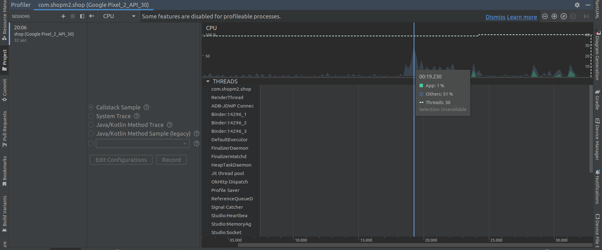

# Глава 16

# Отладка приложений

## 16.1. Используем Android Studio

Среда Android Studio содержит весьма мощные средства отладки приложений. Но
в дополнение к ним вы можете использовать утилиты отладки из Android
SDK, адаптированные для отладки именно Аndrоid-приложений. Сначала мы познако­-
мимся со стандартными средствами среды, а затем рассмотрим утилиты отладки из
Android SDK.

## 16.1.1. Выбор конфигурации запуска

Команда меню Android Studio Run | Run... позволяет выбрать один из профилей
запуска приложения. Можно запустить программу как Аndrоid-приложение, как
Jаvа-апплет, как Jаvа-приложение и т. п. Все зависит от того, какую программу мы
разрабатываем (рис. 16.1 ). Разумеется, приложение должно поддерживать такой
тип запуска. Если ваше приложение, например, не является сервисом, то и запус­-
тить его как сервис вы не можете.

Рис. 16.1. Выбор конфигурации запуска

Для редактирования конфигураций запуска используется команда меню Run | Edit
Configurations. В открывшемся окне вы можете добавить, отредактировать или
удалить конфигурации запуска и отладки.
Конфигурацию запуска можно изменять отдельно для каждого проекта. Параметры
каждой конфигурации задаются на четырех вкладках. Конфигурации запуска по-зволяют запускать один и тот же проект при разных условиях. Так, вы можете соз­дать одну конфигурацию, позволяющую запустить приложение в эмуляторе, а дру­гую -
на реальном устройстве.
Вкладка General (рис. 16.2) позволяет выбрать опции установки, запуска (напри­мер, можно выбрать активность, которая будет загружаться первой), а также цель.
По умолчанию используется цель Open Select Deployment Target Dialog -
откро­ется диалоговое окно выбора цели, в котором будут отображаться созданные эму­
ляторы и физические устройства. Вы же можете выбрать, где запускать приложе­ние - на реальном устройстве или в эмуляторе, чтобы каждый раз не видеть это диалоговое окно.

Рис. 16.2. Вкладка General

Вкладка Miscellaneous (рис. 16.3) позволяет установить несколько разных парамет­-
ров. Например, Clear log before launch - весьма полезный параметр -
очистка журнала перед запуском. Это чтобы при запуске вы видели только сообщения, от­
носящиеся к этому запуску. Также можно открывать окно журнала автоматиче­ски - Show logcat automatically. Вкладка Debugger содержит различные опции отладчика, которые вам вряд ли
придется редактировать. А вот вкладка Profiling (рис. 16.4) позволяет включить
расширенные опции профайлера - будут отслеживаться различные данные, такие
как сетевая нагрузка, события приложения, счетчики объектов. Для этого уровень
API должен быть меньше 26.

Рис. 16.3. Вкладка Miscellaneous

Рис. 16.4. Опции nрофайлера

## 16.1.2. Запуск процесса отладки

Для запуска процесса отладки используется команда Run | Debug. В коде вы може­-
те установить точки останова (breakpoints). Выполнение программы будет приоста-­
новлено, как только она дойдет до очередной точки останова. Чтобы установить
точку останова, щелкните один раз на поле слева от строки кода, которая будет ис-­
пользована как breakpoint. На рис. 16.5 показано, что установлена точка останова
для 63-й строки кода файла MainActivity.java.

Рис. 16.5. Процесс отладки

Когда вы запустите процесс отладки, вам станет доступна вкладка Debug в нижней
части окна. Вы можете добавить интересующую вас переменную в области
Variables и Watches. В результате можно будет наблюдать за тем, как изменяется
их значение. Управлять дальнейшим выполнением программы можно или через меню
Run (в нем станут доступны команды, относящиеся к отладчику), или через область
Debug:

* Resume Program - продолжить выполнение (до следующей точки останова);
* Pause Program - приостановить выполнение программы;
* Stop 'арр' - завершить выполнение программы;
* Step Into - когда выполнение программы дойдет до оператора вызова функции,
  операторы функции будут выполнены пошаrово: по одному за одно нажатие
  клавиши <FS> (именно эта клавиша вызывает команду Step Into);
* Step Over - выполнение всей функции будет произведено за один шаг;
* Run to Cursor - запустить программу до достижения определенной строки кода. Как только выполнение достигнет заданной строки, оно будет приостанов­лено;
* View Breakpoints - показать все точки останова;
* Mute Breakpoints - отключить все точки останова (эта команда организована
  в виде кнопки на панели Debug - слева под кнопкой View Breakpoints).

Это не все команды, относящиеся к отладчику, но их будет вполне достаточно для
организации всего процесса отладки.

# 16.1.3. Профайлинг

Профайлинг - это сбор характеристик работы программы: времени выполнения ее
отдельных фрагментов, потребляемых ресурсов и т. п. Обычно профайлинг выпол­
няется для оптимизации выполнения программы и поиска узких мест в ее произво­-
дительности. Ранее для профайлинга использовалась утилита
Dalvik Debug Monitoring Service(DDMS). Однако сейчас вместо нее используется Android Profiler. Перейдите на соответствующую вкладку в нижней части окна Android Studio. Если у вас эта
вкладка не отображается, выполните команду меню **View | Tool Windows | Android
Protiler.** На рис. 16.6 показаны диаграммы потребляемых приложением ресурсов,
которые вы можете получить с помощью **Android Protiler**.

Рис. 16.6. Профайлинг приложения

Теперь рассмотрим практический пример. Взгляните еще раз на рис. 16.6 - на нем
изображен всплеск потребления оперативной памяти и
ресурсов процессора. Щелкните на пике - например, на пике потребления памяти. Откроется подробная

Рис. 16.7. Исследуем потребление памяти

информация, позволяющая узнать, какие объекты потребляли больше всего памяти
(рис. 16.7).

## 16.1.4. Исследуем файловую систему устройства

Выполните команду меню View | Tool Windows | Device File Explorer -
в правой части окна Android Studio появится область Device File Explorer (рис. 16.8), где вы

Рис. 16.8. Область Device File Explorer

сможете просмотреть файловую систему устройства, на котором сейчас выполняет­ся ваше приложение: или эмулятора, или реального устройства.
