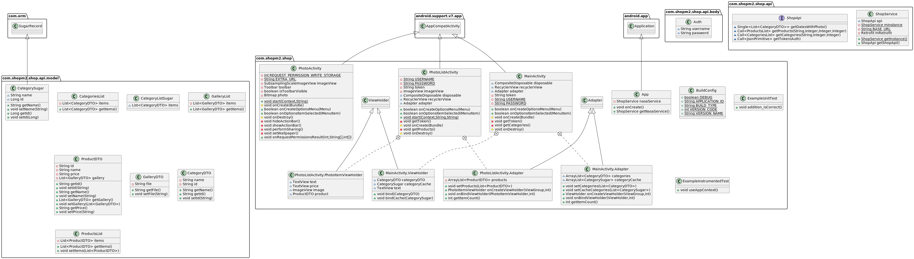

# ТЗ

## А.3 Назначение разработки
### А.3.1 Функциональное назначение
Функциональное назначение программного средства это предоставление информации покупателям о товарах и категориях в интернет-магазине.
### А.3.2 Эксплуатационное назначение
Эксплуатационное назначение состоит в использовании программного средства в сети Интернет на сайтах, разработанных на платформе Magento.
## A.4 Требования к программе
### А.4.1 Требования к функциональным характеристикам
Программное средство должно осуществлять следующий функционал:
- Просмотор категорий;
- Просмотр товаров в определенной категории;
- Просмотр определенного товара.
### А.4.2 Требования к надежности
Надежное функционирование программы должно быть обеспечено выполнением совокупности нижеописанных мероприятий:
• выполнение требований ГОСТ 51188-98;
• защита информации;
• использованием лицензионного программного обеспечения.
#### А.4.2.1 Входные данные
В качестве входных данных являются сведения, внесенные пользователем при регистрации в интернет-магазине.
#### А.4.2.2 Выходные данные
Выходные данные представляются в формате текущих уведомлений от приложения.

## UML
